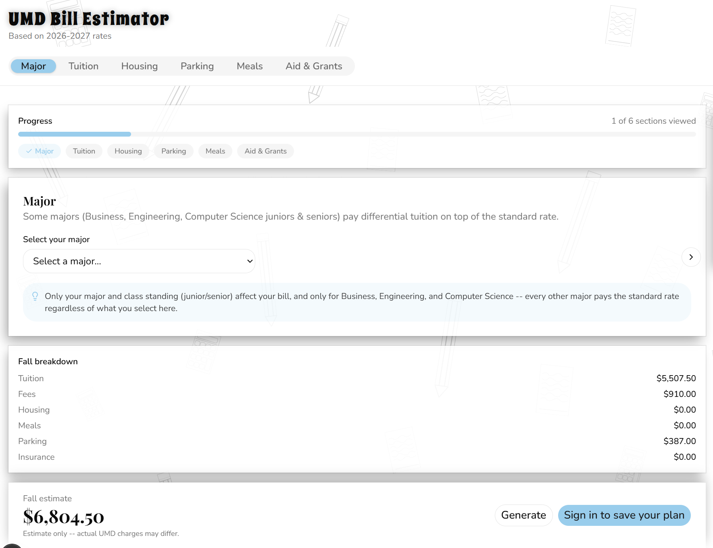
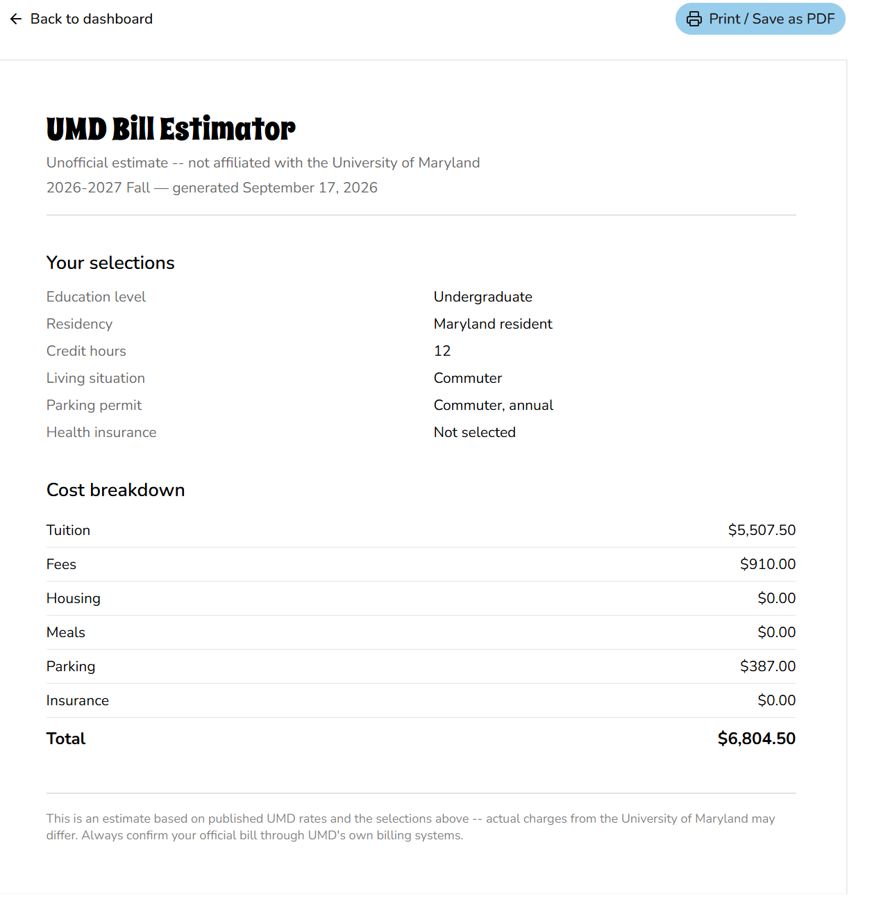
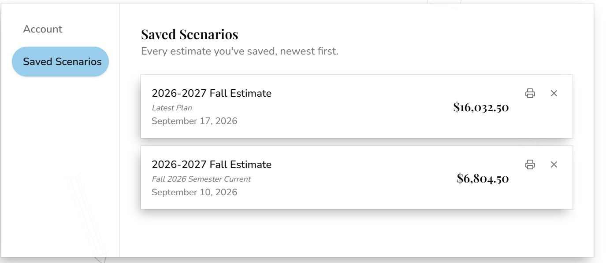

# UMD Bill Estimator

Estimate a real University of Maryland semester bill — tuition, fees, housing, dining, parking, and aid — in one place, compare "what if" scenarios against each other, and ask for it in plain English.

> Solo, student-built project. Not affiliated with, endorsed by, or an official product of the University of Maryland. Rates are pulled from UMD's own published pages but should always be double-checked against the official Office of Student Financial Services before making a real decision.

---

## Why I built this

Figuring out a UMD semester bill means piecing together tuition, fees, housing, dining, and parking from separate UMD pages that don't talk to each other. Comparing "live on campus vs. commute" or swapping meal plans means redoing the math by hand every time.

This app puts it all in one place: pick your real situation and get a live, itemized total that recomputes instantly as anything changes. Save and compare scenarios, generate a clean printable breakdown, or just type what you want in plain English ("out-of-state sophomore, 15 credits, double room with AC") and let it fill in the selections — or ask "can I afford this on $9,000?" and get an answer computed by the same pricing engine the dashboard uses, not a guess from the language model.

## Screenshots

| Dashboard | Bill / print view | Saved scenarios |
|---|---|---|
|  |  |  |
| Every category priced live as selections change | Server-rendered, print/PDF-ready via plain CSS `@page` rules | Sign in to save, name, note, and reload past scenarios |

## Live demo

**[umd-bill-estimator.vercel.app](https://umd-bill-estimator.vercel.app/)**

## Features

- **Live-recomputing dashboard** — every category (tuition, fees, differential tuition, housing, dining, parking, insurance, aid) prices independently; the total recomputes from scratch on every change, never accumulated incrementally.
- **Save/load scenarios behind real auth** — Google OAuth via Supabase, ownership enforced at the query layer.
- **Honest "before aid" vs. "after aid" view** — aid can exceed the bill, shown as an estimated refund instead of floored at $0.
- **Printable, server-rendered results page** — same breakdown functions as the dashboard, so what prints matches what you saw.
- **AI chat that understands the app's data** — parses free text into structured selections, answers "can I afford this" / "what if" questions against the live pricing engine, and can pull real housing photos from S3.
- **Academic-year rollover** — every rate table hangs off an `academic_years` row, so a new year is a data insert, not a code change; old scenarios stay locked to the rates they were computed against.
- **Automated, staged data pipeline** — a monthly AWS Lambda scrapes UMD's live pages into staging tables; promoting into live tables is a deliberate manual step.

## Tech stack

- **Next.js (App Router) + TypeScript + Tailwind** — Server Components read Supabase directly, no API layer in between; Server Actions handle saves; the one Route Handler (`/api/chat`) exists only because the AI feature needs a server-held API key.
- **Supabase (Postgres + Auth)** — 11 reference tables plus `scenarios`, each keyed to an `academic_years` row; Google OAuth for accounts.
- **AWS** — S3 for housing photos, Lambda + EventBridge Scheduler for the monthly scrape, IAM roles scoped one-per-job, Secrets Manager for the one credential that needs it.
- **Gemini API via function calling** — chosen after a real cost comparison against Claude: Gemini's cheap tier came out roughly 10x cheaper for this workload, with a free tier Claude has no equivalent of. The provider is abstracted behind one interface (`AiProvider`), so swapping in a Claude model later means adding a file, not touching the feature.
- **Vitest** — 118 unit tests across 6 files, concentrated on the calculation engine and the AI's data-verification layer.

**Two decisions worth explaining:**

*Why the scrape pipeline never writes straight to live tables.* UMD's pages can change format without warning, and a bad scrape into a staging table is reviewable before it reaches a real bill — a bad scrape straight into a live table isn't. `npm run promote` is the one manual step that's never been automated.

*Why Secrets Manager, not a plain Lambda environment variable,* for the scraper's `SUPABASE_SERVICE_ROLE_KEY`. Plain Lambda env vars are visible in plaintext to anyone who can view the function's console config; a Secrets Manager secret needs its own independently-grantable `secretsmanager:GetSecretValue` permission. The Lambda's execution role holds exactly that one permission, scoped to that one secret's ARN.

## How it's built

**The calculation engine is a set of pure functions — that's the actual point.** One function per pricing category, composed by a single `calculateTotal()`: no side effects, no database calls, same inputs always produce the same output. That's what makes it cheap to unit test exhaustively, and what makes "recompute, don't accumulate" possible — the dashboard's live total is rebuilt from the full current selection state on every change, never nudged incrementally, so there's no accumulator drift to debug. `calculateTotal` and `validateSelections` stay deliberately separate: pricing never checks whether a field is required, and required-ness (always, like tuition and credit hours; conditionally, like a dining plan being required unless housing has a kitchen) lives in exactly one place.

**Scrape → stage → review → promote.** Every scraped rate table has a matching `_staging` table. `npm run scrape` refills staging from UMD's live pages; a human reviews what landed there; `npm run promote` is the only path that copies reviewed values into the tables the app reads. Both commands are idempotent. Scraping now runs on its own monthly AWS Lambda + EventBridge Scheduler cron; promotion was never automated, and won't be.

**The AI feature's safety architecture is the part I'm most proud of.** The model has no way to produce a dollar figure — its return type (`AiSelectionsPatch`) has no field that could hold a price. Every dollar amount anywhere in the app comes from `calculateTotal`.
- **A dynamic-schema validation layer** (`verifyAiPatch.ts`) builds the tool's JSON schema fresh from live rate data on every request, never a hardcoded enum, and re-validates every field the model returns against that same data — including composite pairs like room type + building category that can each look individually valid but still not correspond to any real rate row.
- **A reply-text safety net** (`verifyReplyText.ts`) checks every dollar amount in the model's own generated reply against numbers a tool actually just computed. A mismatch gets discarded in favor of a safe, templated sentence built from the real result. The same layer strips any raw link or image markdown from every reply, closing a bug where the model was pasting a photo tool's S3 URL directly into chat text.
- **`evaluateBudget`**, the "can I afford this" / "what if" tool, doesn't compute anything itself either — it merges hypothetical patches onto the student's real current selections and runs the same `validateSelections` / `calculateTotal` / `calculateNetTotal` every other path uses. Applying a hypothetical requires an explicit click on the result card; nothing an AI response returns ever mutates state on its own.

## Security & engineering precautions

- **Least-privilege IAM, confirmed for real, not just configured.** The S3 upload credential has `PutObject`/`GetObject` only — confirmed by actually attempting a delete against the live bucket and watching it get denied. A separate, narrower credential handles the app's own read path. The scraper Lambda's execution role can reach exactly one Secrets Manager secret and nothing broader.
- **Secrets kept out of both code and plain environment variables where it matters.** The Supabase service-role key never appears in the deployed Lambda's console config in plaintext — it's fetched at runtime from Secrets Manager, with a dynamic `import()` ordering so the rest of the scraper only sees the key after it's landed in the environment.
- **Real IDOR prevention, not assumed.** `scenarios` has zero write RLS policies, so the service-role client bypasses row-level security for every mutation — making the query's own `.eq("user_id", user.id)` filter the only thing standing between one user's request and another's row, not a redundant check. Identity always comes from a verified session, never a client-supplied id. A delete matching zero rows is treated as failure, not assumed to have succeeded.
- **Rate limiting on the AI feature that actually prevents cost abuse.** A Postgres counter table plus one atomic upsert RPC (avoiding the race a naive read-then-write would have), checked before the paid Gemini call — that ordering is what controls cost. Guests are identified by a signed httpOnly cookie rather than IP alone, since shared campus NATs would otherwise misfire on legitimate concurrent users.
- **Defense-in-depth validation**, the same rule checked more than once on purpose: grant-amount bounds are enforced both in the dashboard's input clamping and again inside the Server Action; a saved scenario's selections are re-validated server-side even though the client already validated them; the AI's proposed selections are checked against live rate data even though the UI would never offer an invalid combination.
- **Auth-gated routes protected at two independent layers** — a proxy-level check redirects unauthenticated requests before any page code runs, and the page itself independently re-checks the session.

## Testing & verification discipline

118 unit tests across 6 files (`npm test`, Vitest), concentrated on `calculateTotal`, `validateSelections`, and the AI safety layer (`verifyAiPatch`, `verifyReplyText`) — the code where a silent bug would mean showing someone the wrong dollar amount. Playwright/E2E testing was deliberately skipped for v1 as low-payoff at this stage.

The unit test count is only half the story. Several real bugs in this project's history only showed up under real conditions, not in a test run:

- A `sessionStorage` race condition where the dashboard's persistence write-effect could fire before rehydration completed, silently clobbering real saved selections with fresh-mount defaults — found via direct inspection after a real refresh, confirmed fixed with a deterministic reproduction plus a full manual click-through.
- A retired Gemini model that started 404ing mid-build — root-caused by querying the app's own `ai_parse_logs` table for the real error message, rather than guessing.
- An S3-backed photo feature that returned correctly on the server but rendered empty in the browser — traced to a stale `.next` build cache holding an empty result from before AWS credentials even existed, confirmed by comparing a raw Node script's successful S3 call against the app's silent-empty one.
- An IAM permission boundary verified by actually trying to violate it (the S3 delete-denial test above), not just read off a policy document.

## Found a bug, or have feedback?

I'd genuinely like to hear it — [leave feedback here](https://docs.google.com/forms/d/e/1FAIpQLSccCK7NUbu5fulr_QkXMjUpEQ80U940x-m87SDH990qu8zF9A/viewform?usp=dialog).

## License

MIT — see [`LICENSE`](./LICENSE).
